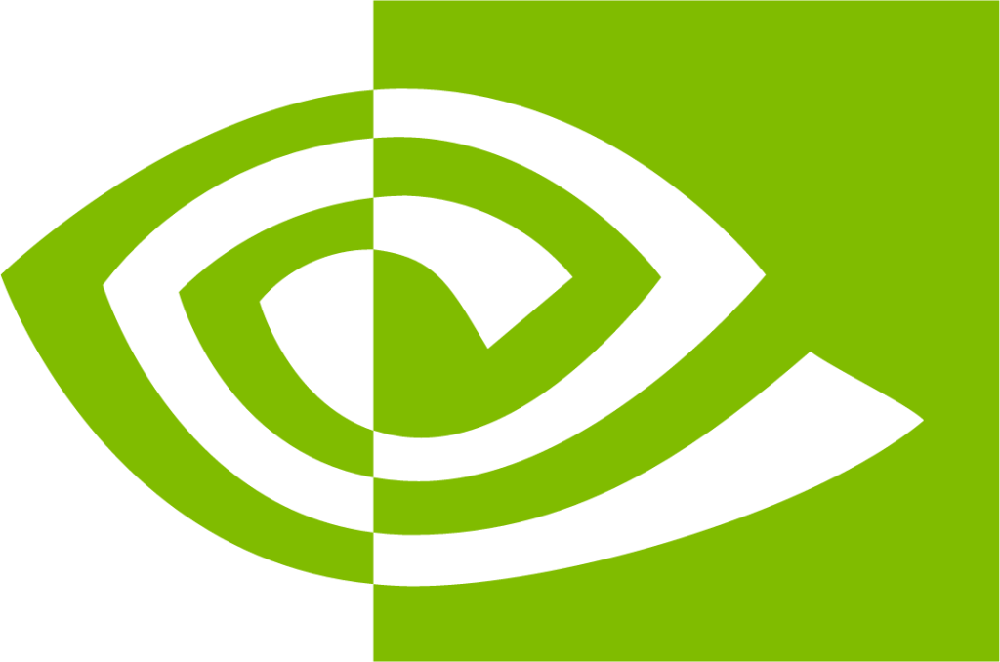
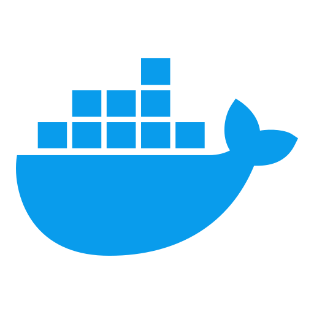

# Matei Galesanu
💻 Full-Stack Developer / Consultant at [Netcompany Netherlands](https://www.netcompany.com/)\
🎓 AI & CGV MSc Computer Science student at [Delft University of Technology](https://www.tudelft.nl/)

Links: [LinkedIn](www.linkedin.com/in/matei-galesanu-a56710230)

## 🎓 Education
### Computer Science MSc (2023-)
*at **Delft University of Technology*** - AI Track, Computer Graphics and Visualization Group

### Computer Science and Engineering BSc (2020-2023)
*at **Delft University of Technology**, graduated **Cum Laude** (GPA 8.0)*

### Space Missions Minor (2022-2023)
*at **Delft University of Technology** and **Leiden University***

## 🎯 Skills
### Programming Languages
 **Python**,
 **Flutter**,
 **Dart**,
 **C#**,
 **C++**,
 **JavaScript/TypeScript**,
 **Java**,

### Technologies & Frameworks
🌐 **HTTP, UDP, gRPC**,
 **React.js**,
 **Next.js**,
 **.NET**,
 **NodeJS**,
 **HTML**,
 **CSS**,
 **PostgreSQL**,
 **OpenCV**,
 **OpenGL**,
 **CUDA**,
 **PyTorch**,
 **Docker**,
 **Git**

## 💻 Experience
###  Full-Stack Developer / Consultant at [Netcompany](https://www.netcompany.com/) (Oct 2023 - Present)
- **Description:** Developing and maintaining various full-stack web applications for managing primary education institutions.
- **Location:** Delft, Netherlands
- **Acquired skills:** C#, .NET, React.js, Next.js, Scrum, Status Reporting, Client Communication

###  Frontend Developer at [LOBSTER Robotics](https://www.lobster-robotics.com/) (Mar 2022 - Sep 2023)
- **Description:** Developed a native UI that allows inspecting telemetry and configuring autonomous underwater vehicles for exploration and seafloor surveys.
- **Location:** Delft, Netherlands
- **Acquired skills:** Flutter, Dart, Python, gRPC, UDP

###  Frontend Developer Intern at [Netcompany](https://www.netcompany.com/int) (Apr 2022 - Jun 2022)
- **Description:** Developed an online Applicant Tracking System designed to increase the efficiency of the recruitment team.
- **Location:** Delft, Netherlands
- **Acquired skills:** Svelte, Typescript, CSS, Agile Methodology 

###  Teaching Assistant at [Delft University of Technology](https://www.tudelft.nl/) (Nov 2021 - Mar 2023)
- **Description:** Graded exams and answered student questions in weekly labs for courses like Web & Database Technology, Information Data Management and Signal Processing.
- **Location:** Delft, Netherlands
- **Acquired skills:** Communication, Active Listening, Adaptability

###  Quality Assurance Intern at [Morecommerce](https://www.morecommerce.com/) (May 2021 - Aug 2021)
- **Description:** Added test classes and migrated tests to a new version for an online marketplace API.
- **Location:** Bucharest, Romania
- **Acquired skills:** JUnit, Mockito

## 🚀 Projects
### 3D Computer Graphics and Animation: Real-time Shaders ([GitHub](https://github.com/janelu44/3dcga-tech-demo))
- **Description:** Created an extensive tech demo showcasing various CG techniques, using OpenGL Shading Language.
- **Keywords:** C++, OpenGL, GLSL

### Data Visualization: DeRailed NL ([GitHub](https://github.com/sashoism/IN4089_InfoVis_Group33))
- **Description:** Built a responsive web visualization tool for previous train delays based on open-source NS datasets.
- **Keywords:** Javascript, D3.js

### Research Project: Neural Radiance Fields as a Rendering Primitive ([GitHub](https://github.com/janelu44/streamnerf)) ([Paper](https://repository.tudelft.nl/file/File_eeb6f904-5f41-41f3-909c-e4eb3988fb26?preview=1))
- **Description:** Adapted a NeRF model for progressive decoding, for online application uses.
- **Keywords:** Python, Flax, Deep Learning

### Image Processing: License Plate Recognition
- **Description:** Designed a robust pipeline for identifying and recognizing Dutch license plate numbers from images or videos with 80% accuracy.
- **Keywords:** Python, OpenCV

### Software Engineering Methods: Sports Centre Backend
- **Description:** Developed a well-tested, scalable microservice-based backend in Spring as part of a student team.
- **Keywords:** Java, Spring

### Computer Graphics: Ray Tracer
- **Description:** Implemented an optimized pipeline for rendering detailed meshes with high fidelity.
- **Keywords:** C++, OpenGL

### Object Oriented Programming: Online Lecture Chat
- **Description:** Developed a client-server application for real-time question management using the Agile methodology.
- **Keywords:** Java, JavaFX, Spring

